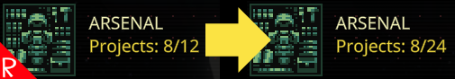

# Quasimorph More Projects

Increases the number of projects the that Magnum Arsenal and Weaponry upgrades provide.  By default, the number of projects will be doubled.  Can be changed in the configuration.  

See [Configuration](#configuration) below.

This mod was commissioned by The Jabberwocky.

# Compatibility

This mod is safe to add and remove at any time.  If the mod is removed, any projects over the maximum amount will stay. New projects cannot be added until the total number of projects are under the maximum amount available.

# Configuration
This mod supports the Mod Configuration Manager mod and the settings can either be configured in the Mods screen, or directly in the config file.

The configuration file will be created on the first game run and can be found at `%AppData%\..\LocalLow\Magnum Scriptum Ltd\Quasimorph_ModConfigs\MoreProjects\config.json`.

|Name|Default|Description|
|--|--|--|
|ProjectCountMultiplier|2|The multiplier for how many projects an upgrade provides.  2 is twice as many|

# Credits
* Special thanks to Crynano for his excellent Mod Configuration Menu. 

# Buy Me a Coffee
If you enjoy my mods and want to buy me a coffee, check out my [Ko-Fi](https://ko-fi.com/nbkredspy71915) page.
Thanks!

# Source Code
Source code is available on GitHub at https://github.com/NBKRedSpy/QM_MoreProjects

# Change Log
## 1.1.0
* MCM Integration
